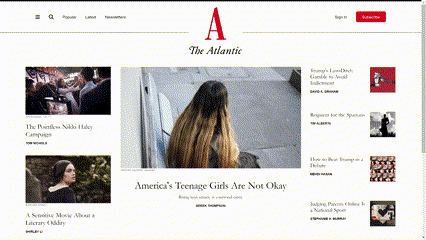

# The Atlantic Website

### Description
A fully-responsive mock-up of the Atlantic homepage.

### Tech Used
- HTML
- CSS

### Lessons Learned
- The box model
- CSS floats mastery - the clearfix hack is a lifesaver 😭

### Notes
Although the use of floats for layouts is outdated and less efficient than modern alternatives like flexbox and grid, I believe that it's still important to learn, in case you encounter situations where you need to work with legacy CSS or support older versions of IE.